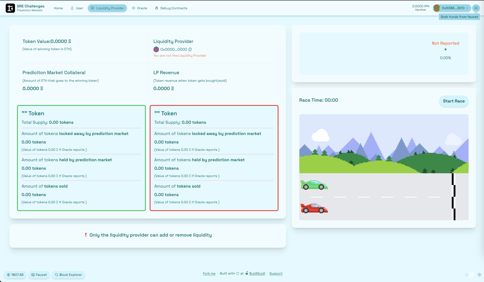
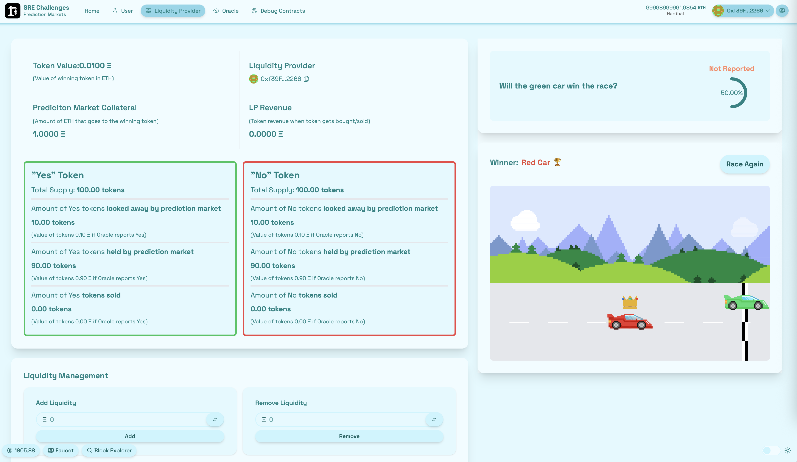
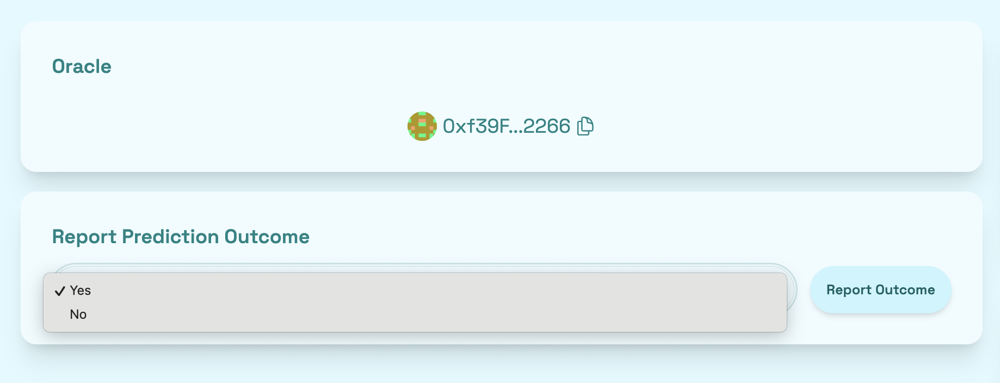
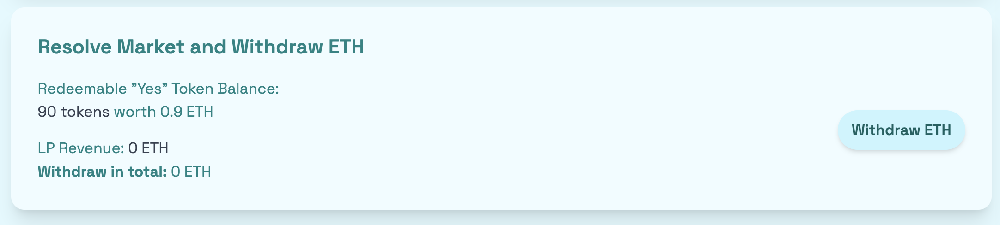
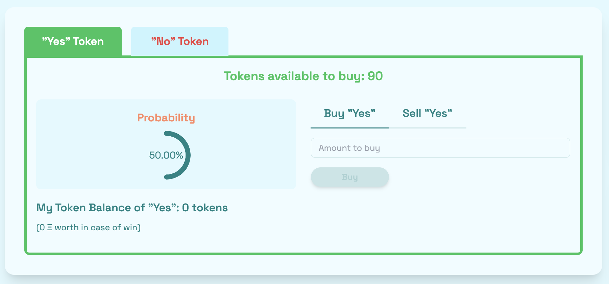
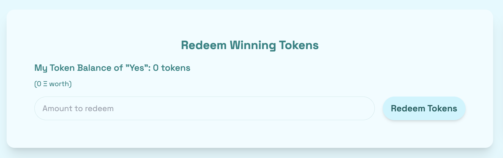

# 🏗 Scaffold-ETH 2

<h4 align="center">
  <a href="https://docs.scaffoldeth.io">Documentation</a> |
  <a href="https://scaffoldeth.io">Website</a>
</h4>

🧪 Ethereumブロックチェーン上で分散型アプリケーション(dapps)を構築するための、オープンソースかつ最新のツールキットです。開発者がスマートコントラクトを作成・デプロイし、そのコントラクトとやり取りするユーザーインターフェースを構築しやすくすることを目指しています。

> [!NOTE]
> 🤖 Scaffold-ETH 2はAI対応です!エージェントがEthereum上で開発するために必要なものが揃っています。詳しくは `.agents/`、`.claude/`、`.opencode`、`.cursor/` を確認してください。

⚙️ NextJS、RainbowKit、Hardhat、Wagmi、Viem、Typescriptを使って構築されています。

- ✅ **コントラクトのホットリロード**: コントラクトを編集すると、フロントエンドが自動的に追従します。
- 🪝 **[カスタムフック](https://docs.scaffoldeth.io/hooks/)**: [wagmi](https://wagmi.sh/) をラップしたReactフック集で、typescriptの自動補完付きでスマートコントラクトとのやり取りを簡単にします。
- 🧱 [**コンポーネント**](https://docs.scaffoldeth.io/components/): フロントエンドを素早く構築するための、よく使われるweb3コンポーネント集です。
- 🔥 **バーナーウォレット & ローカルフォーセット**: バーナーウォレットとローカルフォーセットを使って、アプリケーションを素早くテストできます。
- 🔐 **ウォレットプロバイダーとの連携**: 様々なウォレットプロバイダーに接続し、Ethereumネットワークとやり取りできます。


## 必要な環境

始める前に、以下のツールをインストールしておく必要があります。

- [Node (>= v20.18.3)](https://nodejs.org/en/download/)
- Yarn ([v1](https://classic.yarnpkg.com/en/docs/install/) または [v2+](https://yarnpkg.com/getting-started/install))
- [Git](https://git-scm.com/downloads)


# 📈📉🏎️ Prediction Markets チャレンジ


## はじめに

🔮 このチャレンジでは、あるイベントの結果に基づいてユーザーがERC20の結果トークンを売買できる、シンプルな予測市場を構築しながらその仕組みを学びます。あなたは流動性プロバイダー、オラクル、ユーザーという3つの役割を体験します。イベントの内容は、緑の車と赤の車によるカーレース!🏎️🏁

Solidityの基本的な関数を通して、完全にオンチェーンな予測市場がどのように構成できるかを見ていきます。

<details markdown='1'><summary>予測市場はどう発展してきたか(クリックで展開)</summary>

予測市場そのものは古くから存在しており、**1884年にはウォール街で選挙の賭けが行われていた**という記録があります([このWikipediaのページ](https://en.wikipedia.org/wiki/Prediction_market)を参照)。Ethereum上でも予測市場は以前から関心を集めていましたが、実際に普及するまでには時間がかかりました。

予測市場の一つであるPolymarketは、暗号資産ネイティブの人々だけでなく一般のユーザーにも今日最も広く使われているブロックチェーンアプリケーションの一つです。特に**米国大統領選挙**の際に大きな注目を集めました。

例えば、**2024年米国大統領選挙**では、**Polymarket**で**ドナルド・トランプ氏とカマラ・ハリス氏**の対決に**33億ドル**以上が賭けられました(2024年11月5日時点)。([Wikipedia](https://en.wikipedia.org/wiki/Polymarket)を参照)

予測市場とは本質的に、**決まった終了日**を持つ将来のイベントの結果にユーザーが賭けられる**賭けの市場**です。従来の賭けプラットフォームとの大きな違いは、多くの場合**一度賭けたら、それで確定**という点です。しかし**予測市場**では、イベントが終わる前に**自分のポジションを売却する**ことができます。さらに、パーミッションレスであるというオンチェーンならではのメリットも享受できます。

ある結果に賭ける人が増えれば増えるほど、その側は**より高価**になり、逆側は**より安価**になります。この**動的な価格決定メカニズム**によって暗黙の**確率**が導かれ、それは専門家の意見や世論調査、評論家の見解よりも正確になることがあります。利益が出る見込みがあるときにデータポイントを「更新」する金銭的インセンティブが存在し、逆に誤報告には金銭的損失という形でディスインセンティブが働くからです。

 </details>

### 🧠 私たちの予測市場の仕組み

私たちが構築するのは二択の予測市場です。つまりユーザーは、今回でいえば次のようなyes/no形式の質問に賭けます。

> ❓ 緑の車はレースに勝つか?

シェアを購入するとき、あなたは「Yes」と「No」という2つの結果トークンのどちらかを選ぶことになります。各シェアは、市場がクローズするまではいつでも取引できます。

- ✅ 勝ったトークンを保有していれば、0.01 ETHが支払われます

- ❌ 負けたトークンを保有していれば、その価値は0 ETHになります

- 🧮 結果が判明する前は、トークン価格は0〜0.01 ETHの間で変動し、それぞれの結果の確率を反映します

- 🔄 両方のトークン価格の合計は常に0.01 ETHになります。Polymarketで1シェアが1 USDCを支払うのと同じ仕組みです

### 🔄 私たちのバージョンが違う点

従来の賭けの市場とは異なり、購入した後もロックインされません。市場が解決されていない限り、いつでも結果シェアを売買できます。

Polymarketのようなオーダーブックの代わりに、私たちはオートメイテッド・マーケット・メーカー(AMM)を使います。つまり:

- 🧪 反対側の相手を探す必要がなく、即座に取引できます

- 💸 実装が簡単で、オンチェーンでのガス効率も良くなります

### 💧 流動性はどこから来るのか

市場を立ち上げるには、誰かが初期流動性を提供し、結果トークンを裏付ける担保をロックする必要があります。

- 流動性プロバイダー(LP)は、取引活動から手数料を得ます

- しかし同時にリスクも負います。負けたトークンは無価値になるからです

そのため、人気のあるプラットフォームは、十分な関心と取引量が見込める市場だけを厳選しています([Polymarketのドキュメントを参照](https://learn.polymarket.com/docs/guides/get-started/what-is-polymarket/))。

### 🌐 でも、誰が結果を決めるのか?

ブロックチェーンは、レースに勝ったか負けたかを知ることができません。そこでオラクルの出番です。

オラクルとは、現実世界のデータ(「どちらの車が勝ったか」など)を取得し、誰もが信頼できる形でオンチェーンに報告するための分散的な仕組みです。オラクルがなければ、予測市場を安全に決済する方法がありません。

それでは、チャレンジに入りましょう。

> 💬 このチャレンジに取り組む他のビルダーと出会い、助けを得るには [Prediction Markets Challenge Telegramグループ](https://t.me/+NY00cDZ7PdBmNWEy) へ

---

## Checkpoint 0: 📦 環境構築 📚

> ローカルネットワーク(あなたのコンピュータ上で動くブロックチェーンのエミュレータ)を起動します

```sh
yarn chain
```

2つ目のターミナルウィンドウで、🛰 コントラクトを(ローカルに)デプロイします:

```sh
yarn deploy
```

3つ目のターミナルウィンドウで、📱 フロントエンドを起動します:

```sh
yarn start
```

📱 [http://localhost:3000](http://localhost:3000/) を開いて、アプリを確認してください。

> 👩‍💻 コントラクトの変更をフロントエンドに反映させたいときは、いつでも `yarn deploy` を再実行してください。コントラクトに変更がなくても完全に新規デプロイしたい場合は `yarn deploy --reset` を実行します。

**`Debug Contracts`** タブに移動すると、**`PredictionMarket`** という名前のスマートコントラクトが見つかるはずです。これが私たちのメインコントラクトであり、このチャレンジを通して実装していくものです。まだどの関数も実装していないため、すべて動作しないはずですし、必要な状態変数もまだ表示されません。

> 🏎️ 🏁 カーレースを題材にした予測市場を作りたいので、`User` タブに行って確認してみましょう!(レース自体は完全に独立していて、スマートコントラクトには一切影響しません。)

---

⚠️ コーディング中の気が散る要素を減らすため、`.vscode/settings.json` でCursorの自動提案(Tab補完と予測)を無効化しています。AIチャットとエージェント機能は引き続き有効で、AIアシスタントがコードベースを理解する助けとなるよう `AGENTS.md` と `CLAUDE.md` ファイルにプロジェクトのコンテキストを含めています。

🔒 AIを無効化して、すべて自分の力でやりたいですか?(より深く学ぶためにはおすすめです):

- Cursor: プロジェクトルートの `.cursorignore` ファイルに `*` を追加してください
- VSCode: `.vscode/settings.json` ファイルで `chat.disableAIFeatures` を `true` に設定してください

---

## 🤖 AIガイド学習モード(任意)

コーディングしながら概念を教えてくれるインタラクティブな講師が欲しいですか?このチャレンジは**AIガイド学習モード**に対応しています!

1. **Claude Code** や **Cursor** のようなAIコーディングツールでこのプロジェクトを開く
2. `/start` コマンドを実行する
3. AI講師が各コンセプトを教え、その後コーディング課題を出します
4. あなたがコードを書き、**「check」**と言うと、AIがテストを実行します
5. 助けが必要なら**「hint」**と言うか、AIに解答を見せてほしければ **`/skip`** と言ってください
6. 進捗は保存されます — いつでも `/start` で再開できます

AIは単に答えを教えるのではなく、まず教えてから、あなた自身にコードを実装させます。テストがあなたの成果を検証し、パスしない場合はAIがデバッグを手伝います。

---

## Checkpoint 1: 🔭 プロトコルの構造 📺

私たちの予測市場は、本質的に3つの重要なパーツから成り立っています。

- 🪙 結果を表すトークン(ERC20のようなもの)

- 💧 ユーザーがシェアを売買できる取引の仕組み(AMMまたはオーダーブック)

- 🔮 最終的な結果を決着させるオラクル

私たちのバージョンでは、市場をデプロイすると2つのERC20トークンが生成されます。1つは「Yes」用、もう1つは「No」用です。

🧱 トークンのロジックは `packages/hardhat/contracts/PredictionMarketToken.sol` にあります

このコントラクトは、標準的なERC20仕様をカスタムのミント・バーンロジックで拡張したものです。また、市場のオーナーがトークンを移動できないようにする転送制限もあります — 理由は後ほど説明します 👀

### 🛠️ メインコントラクト: PredictionMarket.sol

`packages/hardhat/contracts/PredictionMarket.sol` を直接編集していくことになります。

私たちのプロトコルは、3つの役割を中心に成り立っています。

1. **👷‍♂️ マーケットオーナー兼流動性プロバイダー** – 市場をセットアップし、ETHで資金を投入する

2. **🧙 オラクル** – 最終的な結果(yesかno)を報告する

3. **🙋‍♂️ ユーザー** – シェアを取引し、ETHを獲得しようとする

そして何と、このチャレンジではあなたがこの3つの役割すべてを担うことになります。

でもまずは、最も重要な役割から始めましょう:**👉 マーケットオーナー兼流動性プロバイダー**

### 💦 なぜ流動性が最初なのか

私たちのようなAMMベースのシステムでは、初期流動性なしには市場は機能しません。つまり、誰かが最初にETHを預け入れる必要があります。

新しい市場がデプロイされると、次のようなことが起こります:

- 担保としてETHが預け入れられる

- コントラクトが「Yes」と「No」のERC20トークンを作成する

- トークンをミントし、流動性プールに追加する

- その後、流動性をさらに追加したり引き出したりできる

このロジックはCheckpoint 2、3、4、6で、Liquidity Providerタブの下に実装していきます。

<details markdown='1'><summary>Liquidity Providerタブを見てみましょう(クリックで展開)</summary>
    
</details>

> ❗️現時点ではフロントエンドはすでに実装済みですが、スマートコントラクトにまだ実装コードがないため、各種機能のボタンはおそらく正常に動作しません。でも、もうすぐ動くようになります!🙂

### 🔮 オラクルになる

市場がセットアップされたら、次は誰かがその決着方法を決める必要があります。

Checkpoint 5では、あなたがオラクルになります — オンチェーンでイベントの最終結果を報告する役です(Oracleタブ)。

> 🧙‍♂️ オラクルとは、(「緑の車は勝ったか?」のような)オフチェーンの事実がブロックチェーンの世界に入ってくるための仕組みです。

<details markdown='1'><summary>Oracleタブを見てみましょう(クリックで展開)</summary>
    
</details>

### 👥 そしていよいよ取引の時間!

市場が作成され、オラクルの準備が整ったら、次はユーザーの出番です(Userタブ)。

Checkpoint 7から9では、ユーザーの主要な操作を構築していきます:

- 🛒 結果トークンを購入する

- 💸 ポジションを解消するために売却する

- 🎉 結果が出たら償還する

これで、あなた自身のスマートコントラクトによって動く、エンドツーエンドの完全な取引機能ができあがります。

<details markdown='1'><summary>Userタブを見てみましょう(クリックで展開)</summary>
    
</details>

> 🎉 Scaffold-Ethチャレンジもここまで来ました 👏🏼 。物事が複雑になってきたので、まず一度チャレンジの設計要件を見直しておくとよいでしょう!空の状態のPredictionMarket.solファイルを見て、各関数がどんな役割を担うのか確認してください。それぞれの関数がどう連携するのか説明できれば最高です!😎

> 🚨 🚨 🦈 Guiding Questions(導きの質問)は正しい方向へ導いてくれますが、これらを見る前に、まずは自分でどう各関数を組み立てるか考えてみましょう!

> 🚨 🚨 🦖 Guiding Questionsのトグル内にあるコードの断片は使えるサンプルの一例ですが、まずは自分で実装コードを書いてみましょう!

## Checkpoint 2: 🔭 予測市場のセットアップ 🏠

予測市場のスマートコントラクトをデプロイする前に、コンストラクタをセットアップし、いくつかの重要な変数を宣言する必要があります — これが市場全体の土台になります。

このステップは、プロトコルの「脳」をブートストラップする作業だと考えてください 🧠

### 🧱 コンストラクタのパラメータ

市場をデプロイするとき、以下を渡します:

- **💧 `_liquidityProvider`** - Ownableにそのまま渡されるオーナーアドレス

- **🧙 `_oracle`** – 後で結果を報告することになるアドレス

- **❓ `_question`** – 実際に問われる予測の内容(例:「緑の車は勝つか?」)

- **💰 `_initialTokenValue`** – 勝ったトークンが支払うETH価値(例:0.01 ETH)

- **📈 `_initialYesProbability`** – 開始時点で「Yes」がどれくらい起こりそうか(例:50%なら50)

- **🔒 `_percentageToLock`** – 確率・価格ロジックで使われる値(詳細はCheckpoint 3で掘り下げます)

### 🧮 その他の状態変数

コントラクトは、市場が存在する間、以下のデータも追跡する必要があります:

- **🏆 `s_ethCollateral`**: トークンを裏付ける合計ETH — いわば賞金プールです

- **💸 `s_lpTradingRevenue`** - ユーザーがトークンを売買することで得られる手数料を追跡します — LPへの報酬です

> ❗️テストをしやすくするため、デプロイ時にオラクルのアドレスを流動性プロバイダーと同じに設定しています(`00_deploy_your_contract.ts` を参照)。また、`_question` などコンストラクタに渡すパラメータの値も**必ず確認してください**。(ヒント: ウォレットに最初のHardhatアカウントを追加するか、オラクルやコントラクトオーナーとしてやり取りするために自分のアカウントを追加してください。デプロイスクリプトで手動でアドレスを設定するか、`yarn account:import` を実行できます。)

> ⏰ 🚨 本番環境の予測市場では、通常、予測されたイベントが発生した後にしか結果を報告できないようにするため、**固定の終了日**のような時間制限を含めます。シンプルさとテストのしやすさのため、この実装では時間の要素を省略しています。

> 💡 `i_<変数名>` はイミュータブル(不変)な変数を、`s_<変数名>` は変更可能な通常の状態変数を表します。

さあ、コントラクトに取り掛かって、予測市場の土台を作り始めましょう!

<details markdown='1'><summary>🦉 Guiding Questions(導きの質問)</summary>

<details markdown='1'><summary>質問1</summary>

> 追跡すべき最も重要な状態変数は何でしょうか(ヒント: コンストラクタを見てみましょう)?コンストラクタでそれらをどう正しい値で初期化しますか?どの変数を `immutable` にできますか?

</details>

<details markdown='1'><summary>質問2</summary>

> コントラクトをデプロイする前に、コンストラクタでどのような重要なチェックを行うべきでしょうか?(ヒント: 追加のガイドとして下の質問を参照し、該当する場合は `errors` セクションにある適切なカスタムエラーを使ってください)

</details>

<details markdown='1'><summary>質問3</summary>

> 初期流動性なしに予測市場が作成されないようにするには、どうすればよいでしょうか?

</details>

<details markdown='1'><summary>質問4</summary>

> `_initialYesProbability` が0%〜100%の有効な範囲内にあることをどう検証しますか?

</details>

<details markdown='1'><summary>質問5</summary>

> `_percentageToLock` が100%を超えないようにするにはどうすればよいでしょうか?

</details>

Guiding Questionsについてよく考えた後、解答コードを見てみましょう!

<details markdown='1'><summary>👩🏽‍🏫 解答コード</summary>

```javascript
//////////////////////////
/// State Variables //////
//////////////////////////

address public immutable i_oracle;
uint256 public immutable i_initialTokenValue;
uint256 public immutable i_percentageLocked;
uint256 public immutable i_initialYesProbability;

string public s_question;
uint256 public s_ethCollateral;
uint256 public s_lpTradingRevenue;

//////////////////
////Constructor///
//////////////////

constructor(
    address _liquidityProvider,
    address _oracle,
    string memory _question,
    uint256 _initialTokenValue,
    uint8 _initialYesProbability,
    uint8 _percentageToLock
) payable Ownable(_liquidityProvider) {
    // /// CHECKPOINT 2 ////
    if (msg.value == 0) {
        revert PredictionMarket__MustProvideETHForInitialLiquidity();
    }
    if (_initialYesProbability >= 100 || _initialYesProbability == 0) {
        revert PredictionMarket__InvalidProbability();
    }

    if (_percentageToLock >= 100 || _percentageToLock == 0) {
        revert PredictionMarket__InvalidPercentageToLock();
    }

    i_oracle = _oracle;
    s_question = _question;
    i_initialTokenValue = _initialTokenValue;
    i_initialYesProbability = _initialYesProbability;
    i_percentageLocked = _percentageToLock;

    s_ethCollateral = msg.value;

    /// Checkpoint 3 ////

}
```

</details>

</details>

以下のコマンドを実行して、すべての変数とチェックが正しく実装されているか確認してください。

```sh
yarn test --grep "Checkpoint2"
```

> 🚨 コントラクトをデプロイする前に、次のCheckpoint 3でコンストラクタの実装を完成させる必要があります。

## Checkpoint 3: 🔨🪙 トークンをミントする

いよいよ予測市場に取引の力を与える番です — 「Yes」と「No」のトークンをミントしましょう!

PredictionMarketコントラクトをデプロイすると、各結果に1つずつ、合計2つのERC20トークンコントラクトも同時に立ち上がります。これはすべてコンストラクタの中で行われます。

### 🚀 トークンのデプロイ

予測市場コントラクトをデプロイする際、関連する**「Yes」**と**「No」**のトークンコントラクトもデプロイする必要があります。これを確実に行うため、コンストラクタの中で両方のトークンコントラクトをインスタンス化します。

あなたの仕事は、PredictionMarketTokenのコンストラクタに正しいパラメータを渡して、両方の結果トークンをデプロイすることです。

必要なパラメータは次のとおりです:

- 🏷️ トークンの**名前**(「Yes」または「No」)

- 🔤 トークンの**シンボル**(「Y」または「N」)

- 👤 市場オーナーの**アドレス**

- 🔢 **初期トークン供給量**(下記で計算)

ミントするトークン数を計算するには、コントラクトに送られたETHを `_initialTokenValue` で割ります。これにより、市場がサポートできる結果トークンの数が求まります:

$$
initialTokenAmount = \frac{msg.value}{initialTokenValue}
$$

デプロイしたトークンコントラクトは、以下の状態変数に格納します:

- `i_yesToken`
- `i_noToken`

### 🎯 初期確率の設定

市場の作成者として、あなたは開始時のオッズ — つまり「Yes」の初期確率を決めることができます。

例えば、緑の車が勝つ見込みが高いと思うなら、次のように設定するかもしれません:

$$
initialYesProbability = 60
$$

でも、ここで一つひねりがあります。まだ何も取引が行われていないのに、どうやってプロトコルは初期確率を組み込めるのでしょうか?

### 🔒 確率をシミュレートするためのトークンロック

そこでトークンロックの仕組みを使います。すでに購入されたかのようにトークンをロックすることで、市場に安定した出発点を与えます。

> 🧠 だからこそ、PredictionMarketToken.solでは市場の作成者によるトークン転送が無効化されています — これらのロックされたトークンが市場に出回らないようにするためです。

### 🧮 実際に見てみましょう

「Yes」を100トークン、「No」を100トークンミントするとします。

「Yes」の確率を60%としてシミュレートし、総トークンの10%をロックしたいとします。

ロックする量は次のように計算します:

$$
lockedYes = 100 * 60\% * 10\% * 2 = 12
$$

$$
lockedNo = 100 * 40\% * 10\% * 2 = 8
$$

これにより:

- ロックされた「Yes」トークンが12

- ロックされた「No」トークンが8

- 取引に使える「Yes」が88、「No」が92

となり、開始時の確率は次のようになります:

$$
\frac{12}{12 + 8} = 60\%
$$

### 🗝️ なぜロックが重要なのか

1. 🧘‍♂️ よりスムーズなスタート – 1回の取引による極端な変動を防ぎます
   ロックがない場合、最初の「Yes」の購入だけで確率が100%になってしまいます:

$$
\frac{1}{1 + 0} = 100\%
$$

2. ⚖️ 価格の安定性 – トークン価格は現在の市場確率に依存します:

$$
tokenPrice = initialTokenValue * marketProbability
$$

これにより、市場は最初からバランスの取れた公正なスタートを切ることができます。

あなたはただトークンをミントしているだけでなく、市場の初期挙動そのものを形作っているのです。

コードを書く準備はできましたか?

> 💡 このパーセンテージは任意に選べます。予測市場をどうセットアップしたいかによって決まります。最初に多くロックするほど価格変動は小さくなりますが、取引できる流動性は少なくなります。

<details markdown='1'><summary>🦉 Guiding Questions(導きの質問)</summary>

<details markdown='1'><summary>質問1</summary>

> 各トークンの正しいinitialTokenAmountをどう計算しますか?(ヒント: Solidityは浮動小数点演算をサポートしていないため、小数値を正しく扱うためにPRECISION定数を使うのを忘れないでください)

</details>

<details markdown='1'><summary>質問2</summary>

> 「Yes」と「No」それぞれの結果に対して2つのトークンコントラクトを作成し、正しい量のトークンをミントするにはどうすればよいでしょうか?(ヒント: PredictionMarketToken.solコントラクトを参考にしてください。)

</details>

<details markdown='1'><summary>質問3</summary>

> 正しい量のトークンをミントした後、予測市場が設定した初期確率を反映するように適切な割合をロックするにはどうすればよいでしょうか?これらのロックされたトークンをコントラクトオーナーのアドレスに正しく転送するには?

</details>

Guiding Questionsについてよく考えた後、解答コードを見てみましょう!

<details markdown='1'><summary>👩🏽‍🏫 解答コード</summary>

```javascript
//////////////////////////
/// State Variables //////
//////////////////////////

PredictionMarketToken public immutable i_yesToken;
PredictionMarketToken public immutable i_noToken;

//////////////////
////Constructor///
//////////////////

constructor(
    address _liquidityProvider,
    address _oracle,
    string memory _question,
    uint256 _initialTokenValue,
    uint8 _initialYesProbability,
    uint8 _percentageToLock
) payable Ownable(_liquidityProvider) {
    /// Checkpoint 2 ////
    if (msg.value == 0) {
        revert PredictionMarket__MustProvideETHForInitialLiquidity();
    }
    if (_initialYesProbability >= 100 || _initialYesProbability == 0) {
        revert PredictionMarket__InvalidProbability();
    }

    if (_percentageToLock >= 100 || _percentageToLock == 0) {
        revert PredictionMarket__InvalidPercentageToLock();
    }

    i_oracle = _oracle;
    s_question = _question;
    i_initialTokenValue = _initialTokenValue;
    i_initialYesProbability = _initialYesProbability;
    i_percentageLocked = _percentageToLock;

    s_ethCollateral = msg.value;

    /// Checkpoint 3 ////
    uint256 initialTokenAmount = (msg.value * PRECISION) / _initialTokenValue;
    i_yesToken = new PredictionMarketToken("Yes", "Y", msg.sender, initialTokenAmount);
    i_noToken = new PredictionMarketToken("No", "N", msg.sender, initialTokenAmount);

    uint256 initialYesAmountLocked = (initialTokenAmount * _initialYesProbability * _percentageToLock * 2) / 10000;
    uint256 initialNoAmountLocked =
        (initialTokenAmount * (100 - _initialYesProbability) * _percentageToLock * 2) / 10000;

    bool success1 = i_yesToken.transfer(msg.sender, initialYesAmountLocked);
    bool success2 = i_noToken.transfer(msg.sender, initialNoAmountLocked);
    if (!success1 || !success2) {
        revert PredictionMarket__TokenTransferFailed();
    }
}
```

</details>

</details>

以下のコマンドを実行して、すべての変数とチェックが正しく実装されているか確認してください。

```sh
yarn test --grep "Checkpoint3"
```

### ✅ テストが通りましたか?あと少しです!

よくできました — テストがグリーンになっていれば、デプロイまであと一歩です!🚀

デプロイボタンを押す前に、次のちょっとした、でも重要な修正を行いましょう:

👇 コントラクト内の `getPrediction()` 関数までスクロールして…

🧩 `/// Checkpoint 3 ///` より下をすべてアンコメントしてください

この関数が、値をフロントエンドに届けてくれます。

> 💡 「Unused function parameter: isReported」や winningToken といった警告が出るかもしれませんが、今は気にせず無視して大丈夫です。

これが終わればデプロイの準備完了です!🔗

> `yarn deploy` を実行して、フロントエンドを確認してください

デプロイが終わったら、**Debug**ページに移動して初期化された値を確認しましょう。

フロントエンドの **Liquidity Provider** タブには、初期の質問、初期流動性/確率、その他の関連変数が表示されるはずです(下のスクリーンショットのような見た目になります)。



## Checkpoint 4: 💦 さらなる流動性

市場が稼働し始めたので、次は流動性プロバイダーにさらなるコントロール権を与えましょう 💪

このCheckpointでは `addLiquidity` と `removeLiquidity` 関数を実装します — これにより市場オーナーはETHを追加投入したり引き出したりでき、その際バランスを保つために結果トークンが自動的にミント・バーンされます。

シンプルにするため、これらの関数を呼び出せるのは元々の市場作成者のみとします。これはすでに `onlyOwner` 修飾子で強制されています 🔒

さあ、作っていきましょう!🧱

> 💡 イベントはすでに**events**セクションで定義されています。

<details markdown='1'><summary>🦉 Guiding Questions(導きの質問)</summary>

<details markdown='1'><summary>質問1</summary>

> 新しく追加された流動性をどう追跡し、予測市場のために対応する量の「YES」「NO」トークンをどうミントしますか?

</details>

<details markdown='1'><summary>質問2</summary>

> removeLiquidity関数では、どのようなバリデーションやチェックを実装すべきでしょうか?

</details>

<details markdown='1'><summary>質問3</summary>

> 削除すべき正しいトークン量をどう決定し、それらをどう削除しますか?(ヒント: PredictionMarketToken.solを参照してください)

</details>

<details markdown='1'><summary>質問4</summary>

> この処理の中で、どの状態変数を更新する必要がありますか?

</details>

<details markdown='1'><summary>質問5</summary>

> どのイベントを発行したいですか?(ヒント: あらかじめ定義されているイベントを見てみましょう)

</details>

Guiding Questionsについてよく考えた後、解答コードを見てみましょう!

<details markdown='1'><summary>👩🏽‍🏫 解答コード</summary>

```javascript
/////////////////
/// Functions ///
/////////////////

function addLiquidity() external payable onlyOwner {
    //// Checkpoint 4 ////
    s_ethCollateral += msg.value;

    uint256 tokensAmount = (msg.value * PRECISION) / i_initialTokenValue;

    i_yesToken.mint(address(this), tokensAmount);
    i_noToken.mint(address(this), tokensAmount);

    emit LiquidityAdded(msg.sender, msg.value, tokensAmount);
}

function removeLiquidity(uint256 _ethToWithdraw) external onlyOwner {
    //// Checkpoint 4 ////
    uint256 amountTokenToBurn = (_ethToWithdraw / i_initialTokenValue) * PRECISION;

    if (amountTokenToBurn > (i_yesToken.balanceOf(address(this)))) {
        revert PredictionMarket__InsufficientTokenReserve(Outcome.YES, amountTokenToBurn);
    }

    if (amountTokenToBurn > (i_noToken.balanceOf(address(this)))) {
        revert PredictionMarket__InsufficientTokenReserve(Outcome.NO, amountTokenToBurn);
    }

    s_ethCollateral -= _ethToWithdraw;

    i_yesToken.burn(address(this), amountTokenToBurn);
    i_noToken.burn(address(this), amountTokenToBurn);

    (bool success,) = msg.sender.call{value: _ethToWithdraw}("");
    if (!success) {
        revert PredictionMarket__ETHTransferFailed();
    }

    emit LiquidityRemoved(msg.sender, _ethToWithdraw, amountTokenToBurn);
}
```

</details>

</details>

以下のコマンドを実行して、関数が正しく実装されているか確認してください。

```sh
yarn test --grep "Checkpoint4"
```

## Checkpoint 5: 🔮 オラクルに報告させる

Ethereumは閉じた世界です — オフチェーンで何が起きているかを知りません。これはデータの安全性と改ざん耐性を保つための設計です。
しかし時には、その境界を越える必要があります。

そこで登場するのがオラクルです — オフチェーンの真実をオンチェーンに届けるメッセンジャーです。

### 🧙 私たちのオラクルは何をするのか?

今回のケースでは、オラクルの仕事は1つだけです:

**👉 どちらの車がレースに勝ったかをコントラクトに伝えること。**

そのために、オラクルはスマートコントラクトの書き込み関数を呼び出し、最終結果 — 「Yes」または「No」 — を渡します。

その結果は、コントラクトに保存され、記憶される必要があります。

### ⚖️ でも待って — それを信頼できるのか?

どんなオラクルにも共通する大きな疑問は、「そのデータをどう信頼するのか」ということです。

そのため、様々なオラクルのソリューションが存在します。UMA(Polymarketのようなプラットフォームで使われている)のようなオプティミスティック・オラクルは、異議が唱えられない限りデータは正しいと仮定します。あるいは、Chainlinkのような分散型オラクルネットワークは、複数のソースからデータを集約して信頼性を高めます。

しかし、私たちのシンプルなセットアップでは、無駄をそぎ落として進めます:

> 🧑‍🏫 市場の作成者がオラクルとして振る舞い、結果を公正に報告すると信頼されるものとします。

オラクルの仕組みそのものに深入りせず、その仕組みを学ぶには最適です。

### 🧱 実装すること

- オラクルが最終結果を確定させるために呼び出せる `report()` 関数

- 勝者(YesまたはNoのトークンコントラクト)を保存する変数 `s_winningToken`

- 市場が解決されたかどうかを示す `s_isReported`

そして、安全性を保つために…

### 🔐 ガードレールを追加する

`predictionNotReported` というカスタム修飾子を作成します — これは:

- 🔒 結果が判明した後に、重要な関数が呼び出されるのを防ぎます

- 🛡️ `report()` が一度しか呼び出せないようにします

最後の封印だと考えてください — オラクルが結果を告げた瞬間、市場はその結果に固定されます。

コーディングの時間です!💻

> 💡 **enumをパラメータとして使う**場合、**カスタムエラー**で検証する方法はありません。無効な値は**即座にrevert**を引き起こします。

<details markdown='1'><summary>🦉 Guiding Questions(導きの質問)</summary>

<details markdown='1'><summary>質問1</summary>

> s_winningTokenはトークンコントラクトのアドレスを保存することを考えると、どんな型が適切でしょうか?また、s_isReportedに適した型は何でしょうか?

</details>

<details markdown='1'><summary>質問2</summary>

> オラクル(必ずしもコントラクトオーナーではない)だけがreport関数を呼び出せるようにするには、どうすればよいでしょうか?

</details>

<details markdown='1'><summary>質問3</summary>

> report関数が予測結果未報告のときにだけ呼び出せるようにするにはどうしますか(修飾子)?他にどの既存の関数がpredictionNotReported修飾子を使うべきでしょうか?

</details>

<details markdown='1'><summary>質問4</summary>

> 予測結果が報告されたとき、どのイベントを発行すべきでしょうか?

</details>

Guiding Questionsについてよく考えた後、解答コードを見てみましょう!

<details markdown='1'><summary>👩🏽‍🏫 解答コード</summary>

```javascript
//////////////////////////
/// State Variables //////
//////////////////////////

PredictionMarketToken public s_winningToken;
bool public s_isReported;

/////////////////
/// Modifiers ///
/////////////////

modifier predictionNotReported() {
    if (s_isReported) {
        revert PredictionMarket__PredictionAlreadyReported();
    }
    _;
}

/////////////////
/// Functions ///
/////////////////

function report(Outcome _winningOutcome) external predictionNotReported {
    //// Checkpoint 5 ////
    if (msg.sender != i_oracle) {
        revert PredictionMarket__OnlyOracleCanReport();
    }
    s_winningToken = _winningOutcome == Outcome.YES ? i_yesToken : i_noToken;
    s_isReported = true;
    emit MarketReported(msg.sender, _winningOutcome, address(s_winningToken));
}

// 🔒 既存の流動性関数にpredictionNotReported修飾子を追加するのを忘れずに:
function addLiquidity() external payable onlyOwner predictionNotReported { ... }
function removeLiquidity(uint256 _ethToWithdraw) external onlyOwner predictionNotReported { ... }
```

</details>

</details>

以下のコマンドを実行して、オラクルのreport関数が正しく実装されているか確認してください。

```sh
yarn test --grep "Checkpoint5"
```

✅ テストが通りましたか?もうすぐです!

素晴らしい — テストがパスして、デプロイまであと少しです!🚀

でもデプロイボタンを押す前に、最後にもう一つ修正が必要です:

👇 コントラクト内の `getPrediction()` 関数までスクロールして…

🧩 `/// Checkpoint 5 ///` より下をすべてアンコメントしてください

さあ(もちろんレースを見た後に)UIのoracleタブに行って結果を報告しましょう 🏎️ 🏁

> 💡 正しいオラクルアドレスで接続していることを確認してください — `00_deploy_your_contract.ts` を見て、どのアドレスが使われているか確認してください。(ヒント: ウォレットに最初のHardhatアカウントを追加するか、オラクルやコントラクトオーナーとしてやり取りするために自分のアカウントを追加してください。デプロイスクリプトで手動でアドレスを設定するか、`yarn account:import` を実行できます。)



## Checkpoint 6: 📉💧 市場を解決し、流動性と取引収益を引き出す

オラクルの配線ができましたね — お疲れ様です!🔌 次は、結果が報告された後に流動性プロバイダー/市場オーナーが**市場を解決**できるようにする番です。

予測市場のオーナーとして、あなたは次のことができるようになるべきです:

- **💰 勝った結果に紐づく残りの担保を引き出す**

- **📊 積み上がった取引手数料を回収する**

これを実現するために、`resolveMarketAndWithdraw` 関数を実装します。始めましょう!

> 💡 もうコントラクトのことはよく理解しているはずなので、ロジックは自分で書いてみてください。ただし、必要な**条件チェック**を忘れずに 🔒

<details markdown='1'><summary>🦉 Guiding Questions(導きの質問)</summary>

<details markdown='1'><summary>質問1</summary>

> 解決を許可する前に、どんな条件をチェックすべきでしょうか?
>
> - 市場は報告済みですか?(ヒント: 後でもこのチェックが必要になるので、修飾子を作ると良さそうです。)
> - コントラクトは勝ちトークンを保有していますか?

</details>

<details markdown='1'><summary>質問2</summary>

> 予測市場のオーナーが勝ちトークンを償還して受け取るETHの量をどう計算しますか?

</details>

<details markdown='1'><summary>質問3</summary>

> 償還された後、勝ちトークンはどうなるべきでしょうか?

</details>

<details markdown='1'><summary>質問4</summary>

> s_lpTradingRevenueについて何をする必要がありますか?リセットしますか?

</details>

<details markdown='1'><summary>質問5</summary>

> 市場が解決され、資金が引き出されたことを示すために、どのイベントを発行すべきでしょうか?

</details>

Guiding Questionsについてよく考えた後、解答コードを見てみましょう!

<details markdown='1'><summary>👩🏽‍🏫 解答コード</summary>

```javascript
/////////////////
/// Modifiers ///
/////////////////

modifier predictionReported() {
    if (!s_isReported) {
        revert PredictionMarket__PredictionNotReported();
    }
    _;
}

/////////////////
/// Functions ///
/////////////////

function resolveMarketAndWithdraw() external onlyOwner predictionReported returns (uint256 ethRedeemed) {
    /// Checkpoint 6 ////
    uint256 contractWinningTokens = s_winningToken.balanceOf(address(this));
    if (contractWinningTokens > 0) {
        ethRedeemed = (contractWinningTokens * i_initialTokenValue) / PRECISION;

        if (ethRedeemed > s_ethCollateral) {
            ethRedeemed = s_ethCollateral;
        }

        s_ethCollateral -= ethRedeemed;
    }

    uint256 totalEthToSend = ethRedeemed + s_lpTradingRevenue;

    s_lpTradingRevenue = 0;

    s_winningToken.burn(address(this), contractWinningTokens);

    (bool success,) = msg.sender.call{value: totalEthToSend}("");
    if (!success) {
        revert PredictionMarket__ETHTransferFailed();
    }

    emit MarketResolved(msg.sender, totalEthToSend);

    return ethRedeemed;
}
```

</details>

</details>

以下のコマンドを実行して、`resolveMarketAndWithdraw` 関数が正しく実装されているか確認してください。

```sh
yarn test --grep "Checkpoint6"
```

コントラクトを再デプロイし、Oracleタブから再度結果を報告してください。

その後、Liquidity Providerタブに移動して、新しい関数を試してみましょう 💥

> 🔍 トークンがバーンされ、ETHがデプロイヤーに戻ってくる様子をよく見てください。



これで**流動性プロバイダー**と**オラクル**の実装が完了したので、いよいよユーザーが**結果トークンを取引**し、賭けを行いながらリアルタイムに市場を形作っていく番です!🛒📈

準備はいいですか?

## Checkpoint 7: 📈📉 トークン取引の価格と確率計算を実装する

コアエンジンを構築しましたね — 流動性が流れ、オラクルが報告を行い、いよいよユーザーが結果トークンを売買して賭けをできるようにする番です。

予測市場の中でも、価格と確率が交わり、取引のたびにオッズが動くパートへようこそ。さっそくやってみましょう!💥

### 🛠️ 目標: 取引を可能にする

ユーザーが「Yes」または「No」トークンを売買できるようにするには、現在の市場のセンチメントを反映した価格システムが必要です。

まずは3つの重要なヘルパー関数を実装するところから始めます:

- `_calculatePriceInEth`

- `_getCurrentReserves`

- `_calculateProbability`

そして、次の公開の価格関数で仕上げます:

- `getBuyPriceInEth`

- `getSellPriceInEth`

### 🔧 核となる考え方

ユーザーが売買するたびに、それにいくらのETHがかかるか(または得られるか)を計算する必要があります。そこで活躍するのが `_calculatePriceInEth` です。シンプルにするため線形の価格モデルを使いますが、これはあくまで出発点であることを覚えておいてください。後で別のモデルにアップグレードすることもできます。

キーとなる計算式は次のとおりです:

$$
price = initialTokenValue * probabilityAvg * tradingAmount
$$

様々なシナリオで価格がどう振る舞うか、下の表を確認してください。両方の結果の価格の合計は常に**0.01 ETH**になることに注意してください。


### 💡 仕組み

ロックされているトークンの数に基づいて、取引の前後でのある結果の確率を計算します。そして、その2つを平均し、ユーザーが売買したい量を掛け合わせます。

`_calculatePriceInEth` を実装するには:

1. `_getCurrentReserves` を使って、コントラクトにどれだけのトークンがあるかを知る

2. `_calculateProbability` を使って、ある結果が勝つ確率を求める

3. 取引の前後の確率を平均する

4. initialTokenValueと量を掛けて価格を得る

### 📊 価格関数の仕組み(とその癖)

この価格モデルは、ユーザーに「まとめ買い割引」を提供します — 一度に多く買うほどお得になります。これは、大きな取引ほど通常コストが高くなるDeFiのスリッページとは正反対です 😎

これがどう作用するか、具体例で見てみましょう。

🚗 セットアップ:

- totalSupplyYes = 100, totalSupplyNo = 100
- currentReserveYes = 90, currentReserveNo = 90
- tokenLockedYes = 10, tokenLockedNo = 10

1️⃣ **1回の大きな取引: 60個の「Yes」トークンを1回の取引で購入**

$$
probabilityYes = \frac{tokenSoldYes + tokenLockedYes}{tokenLockedYes+ tokenLockedNo + tokenSoldYes + tokenSoldNo}
$$

- probabilityBefore = 50%
- probabilityAfter = (60 + 10 ) / (10 + 10 + 60 + 0) = 87.5%
- probAvg = (probBefore + probAfter) / 2 = 68.75%
- price = 0.01 ETH * 68.75% * 60 = 0.4125 ETH

**2️⃣ 2回の小さな取引: 60個の「Yes」トークンを30個ずつ2回に分けて購入**

**1回目の取引:**

- probBefore = 50%, probAfter = 80%
- probAvg = 65%
- price = 0.01 ETH \* 65% \* 30 = 0.195 ETH

**2回目の取引:**

- probBefore = 80%, probAfter = $87.5%
- probAvg = 83.75%
- price = 0.01 ETH \* 83.75% \* 30 = 0.2515 ETH

**合計** = 0.195 + 0.25125 = **0.44625 ETH** > **0.4125 ETH**

🔺 1回の取引よりも高くついています!

> 🧠 **では、なぜ2回に分けた小さな取引の方が、1回の大きな取引よりも高くつくのでしょうか?**
>
> これは、取引の開始時点と終了時点の**平均確率**を使って価格を計算しているために起こります。大きな取引を複数の小さな取引に分割すると、それぞれの取引が独自の開始・終了確率を再計算するため、上昇相場では**全体としての平均確率が高くなり**ます。だからこそ、合計コストは**より高く**なるのです。
>
> この挙動は、シンプルな線形近似を使っていることの副作用です。価格モデルを**もっと正確に**したいなら、微積分の**積分**のように、取引を**無限に小さなステップの連続**としてシミュレートすることもできます。そうすれば、大きな取引に対してより滑らかで精緻なコスト曲線が得られますが、その分複雑さが増します。

### 🛠️ 実装上の注意点

コーディングする際は、次の重要な仕組みを覚えておいてください:

- **購入**は、その結果の確率を押し上げます 📈

- **売却**はその逆で、確率を押し下げます 📉

getBuyPriceInEthとgetSellPriceInEthはどちらも公開関数で、単に `_calculatePriceInEth` を呼び出し、購入か売却かを示すフラグを渡すだけです。

さあ、実装してみましょう!⚡

<details markdown='1'><summary>🦉 Guiding Questions(導きの質問)</summary>

<details markdown='1'><summary>質問1</summary>

> _getCurrentReservesが_outcomeに基づいて正しい値を返すようにするにはどうしますか?(ヒント: リザーブを取得する際に、選択された結果をどう区別するか考えてみましょう)

</details>

<details markdown='1'><summary>質問2</summary>

> トークンを売却する際にアンダーフローを避けるために、どんなチェックを追加すべきでしょうか?(ヒント: ユーザーがリザーブにある量より多くのトークンを売却しようとしていないか確認してください。)

</details>

<details markdown='1'><summary>質問3</summary>

> probabilityBefore、probabilityAfter、probabilityAvgをどう計算しますか?(ヒント: 上の例を参照してください。)

</details>

<details markdown='1'><summary>質問4</summary>

> 価格を計算する際、他に何を気をつけるべきでしょうか?(ヒント: 小数とPRECISION定数を忘れずに。)

</details>

<details markdown='1'><summary>質問5</summary>

> getBuyPriceInEthとgetSellPriceInEthの内部では、どの関数を呼び出す必要がありますか?この2つの違いは何ですか?

</details>

Guiding Questionsについてよく考えた後、解答コードを見てみましょう!

<details markdown='1'><summary>👩🏽‍🏫 解答コード</summary>

```javascript
/////////////////
/// Functions ///
/////////////////

function getBuyPriceInEth(Outcome _outcome, uint256 _tradingAmount) public view returns (uint256) {
    /// Checkpoint 7 ////
    return _calculatePriceInEth(_outcome, _tradingAmount, false);
}

function getSellPriceInEth(Outcome _outcome, uint256 _tradingAmount) public view returns (uint256) {
    /// Checkpoint 7 ////
    return _calculatePriceInEth(_outcome, _tradingAmount, true);
}

/////////////////////////
/// Helper Functions ///
////////////////////////

function _calculatePriceInEth(Outcome _outcome, uint256 _tradingAmount, bool _isSelling)
    private
    view
    returns (uint256)
{
    /// Checkpoint 7 ////
    (uint256 currentTokenReserve, uint256 currentOtherTokenReserve) = _getCurrentReserves(_outcome);

    /// Ensure sufficient liquidity when buying
    if (!_isSelling) {
        if (currentTokenReserve < _tradingAmount) {
            revert PredictionMarket__InsufficientLiquidity();
        }
    }

    uint256 totalTokenSupply = i_yesToken.totalSupply();

    /// Before trade
    uint256 currentTokenSoldBefore = totalTokenSupply - currentTokenReserve;
    uint256 currentOtherTokenSold = totalTokenSupply - currentOtherTokenReserve;

    uint256 totalTokensSoldBefore = currentTokenSoldBefore + currentOtherTokenSold;
    uint256 probabilityBefore = _calculateProbability(currentTokenSoldBefore, totalTokensSoldBefore);

    /// After trade
    uint256 currentTokenReserveAfter =
        _isSelling ? currentTokenReserve + _tradingAmount : currentTokenReserve - _tradingAmount;
    uint256 currentTokenSoldAfter = totalTokenSupply - currentTokenReserveAfter;

    uint256 totalTokensSoldAfter =
        _isSelling ? totalTokensSoldBefore - _tradingAmount : totalTokensSoldBefore + _tradingAmount;

    uint256 probabilityAfter = _calculateProbability(currentTokenSoldAfter, totalTokensSoldAfter);

    /// Compute final price
    uint256 probabilityAvg = (probabilityBefore + probabilityAfter) / 2;
    return (i_initialTokenValue * probabilityAvg * _tradingAmount) / (PRECISION * PRECISION);
}

function _getCurrentReserves(Outcome _outcome) private view returns (uint256, uint256) {
    /// Checkpoint 7 ////
    if (_outcome == Outcome.YES) {
        return (i_yesToken.balanceOf(address(this)), i_noToken.balanceOf(address(this)));
    } else {
        return (i_noToken.balanceOf(address(this)), i_yesToken.balanceOf(address(this)));
    }
}

function _calculateProbability(uint256 tokensSold, uint256 totalSold) private pure returns (uint256) {
    /// Checkpoint 7 ////
    return (tokensSold * PRECISION) / totalSold;
}
```

</details>

</details>

以下のコマンドを実行して、すべての関数が正しく実装されているか確認してください。

```sh
yarn test --grep "Checkpoint7"
```

## Checkpoint 8: 🔁💰 「Yes」または「No」トークンをETHで売買する

価格エンジン(`getBuyPriceInEth` / `getSellPriceInEth`)を構築できたので、いよいよ実際の取引で市場に命を吹き込みましょう!次の2つの重要な関数を実装します:

- `buyTokensWithETH`

- `sellTokensForEth`

### 🛒 トークンの購入

ユーザーが「Yes」や「No」のトークンを手に入れる前に、いくつかの健全性チェックを行う必要があります:

- ✅ 市場はまだアクティブか?
- ✅ トークンの量は0より大きいか?(ヒント: 修飾子で強制できます!)
- ✅ コントラクトは売るのに十分なトークンを持っているか?
- ✅ 送られたETHは `getBuyPriceInEth` から得られる正確な価格と一致しているか?
- ✅ 呼び出し元は市場オーナーではないか?

すべてのチェックをクリアしたら、取引収益(`s_lpTradingRevenue`)を更新し、結果トークンを購入者に送ります。簡単ですね!

### 💸 トークンの売却

次は、現金化したいユーザーを扱います(似たようなプロセスですが逆方向です)。

追加で以下をチェックします:

- ✅ トークンの量は有効か?
- ✅ コントラクトは支払うのに十分なETHを持っているか?
- ✅ ユーザーはコントラクトにトークンの転送を承認しているか?

`getSellPriceInEth` を使って支払うべきETHを計算します。そして:

1. `s_lpTradingRevenue` からETHを差し引く

2. それを売却者に転送する

3. オンチェーンでの透明性を保つため、イベントの発行を忘れずに 📢

さあ、リアルタイム取引を実現させましょう!🔥

<details markdown='1'><summary>🦉 Guiding Questions(導きの質問)</summary>

<details markdown='1'><summary>質問1</summary>

> 取引量が0でないことをどう確認しますか?(ヒント: 修飾子を作り、利用可能なカスタムエラーを見てみましょう)そして予測市場がまだ報告されていないことは?

</details>

<details markdown='1'><summary>質問2</summary>

> 意図したトークン数に対して、正しい量のETHがコントラクトに送られたことをどう検証しますか?(ヒント: 以前実装した関数を思い出してください。)

</details>

<details markdown='1'><summary>質問3</summary>

> コントラクトが購入に十分なトークンを保有しているかをどうチェックしますか?

</details>

<details markdown='1'><summary>質問4</summary>

> 購入の際、s_lpTradingRevenue状態変数にはどんな値を加算すべきでしょうか?

</details>

<details markdown='1'><summary>質問5</summary>

> ユーザーが売却したいとき、コントラクトがトークンの許可(allowance)をチェックするにはどうすればよいでしょうか?(ヒント: このチェックは許可を確認するだけであるべきで、設定はしません。それは別のトランザクションで行う必要があります。)

</details>

<details markdown='1'><summary>質問6</summary>

> ユーザーに送り返す正しいETH量をどう計算しますか?(ヒント: 以前実装したヘルパー関数を思い出してください。)

</details>

<details markdown='1'><summary>質問7</summary>

> 売却の際、s_lpTradingRevenueからは何を差し引くべきでしょうか?

</details>

<details markdown='1'><summary>質問8</summary>

> _tradingAmountがユーザーに送られることをどう保証しますか?

</details>

<details markdown='1'><summary>質問9</summary>

> これらの関数ではどのイベントを発行する必要がありますか(Eventsセクションを見て、正しいものを選んでください)?

</details>

Guiding Questionsについてよく考えた後、解答コードを見てみましょう!

<details markdown='1'><summary>👩🏽‍🏫 解答コード</summary>

```javascript
/////////////////
/// Modifiers ///
/////////////////

modifier notOwner() {
    if (msg.sender == owner()) {
        revert PredictionMarket__OwnerCannotCall();
    }
    _;
}


modifier amountGreaterThanZero(uint256 _amount) {
    if (_amount == 0) {
        revert PredictionMarket__AmountMustBeGreaterThanZero();
    }
    _;
}

 /////////////////
 /// Functions ///
 /////////////////

function buyTokensWithETH(Outcome _outcome, uint256 _amountTokenToBuy)
    external
    payable
    amountGreaterThanZero(_amountTokenToBuy)
    predictionNotReported
    notOwner
{
    /// Checkpoint 8 ////
    uint256 ethNeeded = getBuyPriceInEth(_outcome, _amountTokenToBuy);
    if (msg.value != ethNeeded) {
        revert PredictionMarket__MustSendExactETHAmount();
    }

    PredictionMarketToken optionToken = _outcome == Outcome.YES ? i_yesToken : i_noToken;

    if (_amountTokenToBuy > optionToken.balanceOf(address(this))) {
        revert PredictionMarket__InsufficientTokenReserve(_outcome, _amountTokenToBuy);
    }

    s_lpTradingRevenue += msg.value;

    bool success = optionToken.transfer(msg.sender, _amountTokenToBuy);
    if (!success) {
        revert PredictionMarket__TokenTransferFailed();
    }

    emit TokensPurchased(msg.sender, _outcome, _amountTokenToBuy, msg.value);
}

function sellTokensForEth(Outcome _outcome, uint256 _tradingAmount)
    external
    amountGreaterThanZero(_tradingAmount)
    predictionNotReported
    notOwner
{
    /// Checkpoint 8 ////
    PredictionMarketToken optionToken = _outcome == Outcome.YES ? i_yesToken : i_noToken;
    uint256 userBalance = optionToken.balanceOf(msg.sender);
    if (userBalance < _tradingAmount) {
        revert PredictionMarket__InsufficientBalance(_tradingAmount, userBalance);
    }

    uint256 allowance = optionToken.allowance(msg.sender, address(this));
    if (allowance < _tradingAmount) {
        revert PredictionMarket__InsufficientAllowance(_tradingAmount, allowance);
    }

    uint256 ethToReceive = getSellPriceInEth(_outcome, _tradingAmount);

    s_lpTradingRevenue -= ethToReceive;

    (bool sent,) = msg.sender.call{value: ethToReceive}("");
    if (!sent) {
        revert PredictionMarket__ETHTransferFailed();
    }

    bool success = optionToken.transferFrom(msg.sender, address(this), _tradingAmount);
    if (!success) {
        revert PredictionMarket__TokenTransferFailed();
    }

    emit TokensSold(msg.sender, _outcome, _tradingAmount, ethToReceive);
}
```

</details>

</details>

以下のコマンドを実行して、すべての関数が正しく実装されているか確認してください。

```sh
yarn test --grep "Checkpoint8"
```

そして `yarn deploy` を実行し、フロントエンドで動作を確認し、確率がどう変化するか見てみましょう。

> ❗️💡 **流動性プロバイダーとは別のアカウントを使う**ようにしてください。そうしないと**トークンの売却が制限されます**



## Checkpoint 9: ユーザーとして勝ちトークンを償還する

賭けをして…レースが終わり…そしてあなたの予想が当たりました。さあ、換金の時間です!🎉
最後に実装するユーザー向け関数は redeemWinningTokens で、正しい結果に賭けたユーザーが**各勝ちトークンを0.01 ETHと交換**できるようにするものです。

### ✅ 償還チェックリスト

報酬を配る前に、いくつか確認すべきことがあります:

- 🟢 市場は解決済みですか?

- 🪙 ユーザーは勝ちトークンを保有していますか?

- 💰 実際に償還できるものがありますか?

- 🚫 呼び出し元は市場オーナーではありませんか?

### 💸 支払いロジック

すべてのチェックをクリアしたら、次のことを行います:

1. ユーザーの合計ETH支払い額を計算する

2. その額を `s_ethCollateral` から差し引く

3. 勝ちトークンをバーンする(役目を終えたので)🔥

4. ETHをユーザーのウォレットに直接転送する

5. 償還をオンチェーンに記録するためイベントを発行する

これがユーザーにとっての最終ステップです — 良い予測が報われる、まさに払い戻しの瞬間です。

<details markdown='1'><summary>🦉 Guiding Questions(導きの質問)</summary>

<details markdown='1'><summary>質問1</summary>

> 予測市場はすでに報告済みですか(ヒント: 修飾子)?ユーザーは勝ちトークンを持っていますか?償還したい量は0より大きいですか(ヒント: 修飾子)?

</details>

<details markdown='1'><summary>質問2</summary>

> ユーザーが受け取るETHの量をどう計算しますか?

</details>

<details markdown='1'><summary>質問3</summary>

> ユーザーが償還した勝ちトークンはどうしますか?

</details>

<details markdown='1'><summary>質問4</summary>

> どのイベントを発行する必要がありますか?

</details>

Guiding Questionsについてよく考えた後、解答コードを見てみましょう!

<details markdown='1'><summary>👩🏽‍🏫 解答コード</summary>

```javascript
/////////////////
 /// Functions ///
 /////////////////

function redeemWinningTokens(uint256 _amount) external amountGreaterThanZero(_amount) predictionReported notOwner {
    /// Checkpoint 9 ////
    if (s_winningToken.balanceOf(msg.sender) < _amount) {
        revert PredictionMarket__InsufficientWinningTokens();
    }

    uint256 ethToReceive = (_amount * i_initialTokenValue) / PRECISION;

    s_ethCollateral -= ethToReceive;

    s_winningToken.burn(msg.sender, _amount);

    (bool success,) = msg.sender.call{value: ethToReceive}("");
    if (!success) {
        revert PredictionMarket__ETHTransferFailed();
    }

    emit WinningTokensRedeemed(msg.sender, _amount, ethToReceive);
}
```

</details>

</details>

以下のコマンドを実行して、このチャレンジ最後の関数が正しく実装されているか確認してください。

```sh
yarn test --grep "Checkpoint9"
```

その後 `yarn deploy` を実行してフロントエンドで試してみましょう。事前にいくつか勝ちトークンを購入し、レースの結果を報告しておいてください。それが終われば、好きな量を償還できるはずです。



おめでとうございます、実装を無事に完了しました 🎉🎉🎉

## Checkpoint 10: 💾 コントラクトをデプロイしよう! 🛰

📡 `packages/hardhat/hardhat.config.ts` の `defaultNetwork` を、**SepoliaまたはOptimism Sepolia**のお好きな方に編集してください

🔐 `yarn generate` を使って**デプロイヤーアドレス**を生成する必要があります。これによりニーモニックが作成され、ローカルに保存されます。

👩‍🚀 `yarn account` を使って、デプロイヤーアカウントの残高を確認できます。

⛽️ 自分のウォレットから**デプロイヤーアドレス**にETHを送るか、選んだネットワークのパブリックフォーセットから入手する必要があります。

> 🚨🚨 **!!!警告!!!** デプロイする前に、必ずコンストラクタのETH量を自分の好みに合わせて調整してください。デフォルトでは、コントラクトは**1 ETH**でデプロイされ、トークン価値は**0.01 ETH**に設定されています。どれだけのETHを割り当てたいかに応じて、例えば**0.1 ETH**と**0.001 ETH**に変更したくなるかもしれません。🚨🚨

🚀 `yarn deploy` を実行して、スマートコントラクトを(`hardhat.config.ts` で選択した)パブリックネットワークにデプロイしてください

> 💬 ヒント: `hardhat.config.ts` の `defaultNetwork` を `sepolia` や `optimismSepolia` に設定するか、`yarn deploy --network sepolia` または `yarn deploy --network optimismSepolia` を実行することもできます。

💻 [http://localhost:3000](http://localhost:3000/) でフロントエンドを確認し、正しいネットワークが表示されていることを確認してください。

📦 `yarn vercel` を実行して、フロントエンドをパッケージ化しデプロイしてください。

> まず `yarn vercel:login` を実行してVercelにログインする必要があるかもしれません。(メール、GitHubなどで)ログインすれば、デフォルトのオプションで動作するはずです。

> 同じ本番URLに再デプロイしたい場合は `yarn vercel --prod` を実行してください。`--prod` フラグを省略すると、プレビュー/テスト用URLにデプロイされます。

> Vercelへのデプロイ手順に従ってください。公開URLが発行されます。

> 🦊 パブリックなテストネットにデプロイしたので、自分が所有するウォレットかバーナーウォレットを使って接続する必要があります。デフォルトでは 🔥 バーナーウォレットはlocalhostでのみ利用可能です。フロントエンド設定(`packages/nextjs/` の `scaffold.config.ts`)で `burnerWalletMode: "allNetworks"` を設定すれば、すべてのチェーンで有効化できます

**本番グレードのアプリのためのサードパーティサービス設定。**

デフォルトでは、🏗 Scaffold-ETH 2はAlchemyやEtherscanといった人気サービス向けの既定のAPIキーを提供しています。これにより、これらのサービスに登録する手間なく、より簡単にアプリケーションの開発とテストを始められます。**Speedrun Ethereum**を完了するにはこれで十分です。

本番グレードのアプリケーションでは、(レート制限の問題を避けるため)自分自身のAPIキーを取得することをおすすめします。以下で設定できます:

- 🔷 `packages/hardhat/.env` と `packages/nextjs/.env.local` の `ALCHEMY_API_KEY` 変数。[Alchemyダッシュボード](https://dashboard.alchemy.com/) からAPIキーを作成できます。
- 📃 `packages/hardhat/.env` の `ETHERSCAN_API_KEY` 変数に、生成したAPIキーを設定します。キーは[こちら](https://etherscan.io/myapikey)から取得できます。

> 💬 ヒント: 本番運用中のアプリでは、nextjs用の環境変数はVercel/システムの環境設定に保存し、ローカルテストでは .env.local を使うことをおすすめします。

## Checkpoint 11: 📜 コントラクトの検証

`yarn verify --network your_network` コマンドを実行して、コントラクトがetherscanに登録されているか確認しましょう 🛰

👉 [SpeedRunEthereum.com](https://speedrunethereum.com/) に提出するURLを取得するには、[Sepolia Etherscan](https://sepolia.etherscan.io/)(OP Sepoliaにデプロイした場合は[Optimism Sepolia Etherscan](https://sepolia-optimism.etherscan.io/))でこのアドレスを検索してください 🏃‍♀️

## Checkpoint 12: 🧠 🍔 最後に考えてみよう

ついにここまで来ましたね — ゴールです!🏁💥

ここまでで、あなたはオンチェーンの予測市場をゼロからフルスクラッチで構築しました。これは大きな達成です。でも、Devconに参加したVitalikのような気分になって立ち去る前に、しっかりしたプロトタイプから本番運用可能なプロトコルへとレベルアップするための、最後の考察をいくつか紹介します。

**🔐 期限を追加する**
市場には最終性が必要です。設定した日付を過ぎたら取引をロックする、あるいは解決をトリガーする時間ベースの条件を導入しましょう。

**🔮 オラクルをアップグレードする**
今のところ、おそらくシンプルな中央集権型のオラクルを使っているはずです。テストにはそれで十分ですが、実世界では信頼の最小化が重要です。結果の報告をより分散化する、あるいは暗号経済的により安全にする方法を探ってみましょう。

**🧱 トークンロックを見直す**
本当にすべてのトークンを事前にロックする必要があるでしょうか?バーチャルトレード、初期ポジションのシミュレーション、革新的な流動性ブートストラップ手法など、もっと賢い仕組みを検討してみてください。創造的に — このシステムはあなたが自由に作り変えられるものです。

**💸 LPに報酬を与える**
取引手数料(例: 1取引あたり3%)を追加し、そのETHを `s_lpTradingRevenue` に送りましょう。流動性プロバイダーに報いて、より持続可能な市場を作るためのシンプルな方法です。

**🧠 他の市場設計を探る**
これまで使ってきた線形の価格モデルは、数ある選択肢の一つに過ぎません。オーダーブックを構築したり、AIエージェントによる動的な価格設定を探求したりと、まるごと置き換えることもできます。可能性は無限に開かれています。

### ⚠️ LPはお金を失うこともある — その理由を見てみよう

明示的には触れていない重要なリスクが一つあります: 市場作成者として、**あなたはお金を失う可能性がある**ということです。以下は、次の初期パラメータに基づく現行モデルでの最悪ケースの例です:

---

### ⛔️ ケース1: あるユーザーが「Yes」トークンを90個購入し、「Yes」が勝つ場合

- 最終確率 = (90 + 10) / (10 + 10 + 90 + 0) = **90.9%**
- 平均確率 = (50% + 90.9%) / 2 = **70.45%**
- ユーザーが90トークンを購入 → **0.01 ETH × 70.45% × 90 = 0.637 ETH**
- ユーザーの勝利: **0.01 ETH × 90 = 0.9 ETH → 41%の利益**
- LPは10個の「Yes」トークンから **0.1 ETH**、さらに取引から0.637 ETHを得る
- LP合計: **0.1 + 0.637 - 1 = -0.263 ETH** → **約26%の損失**

---

### ✅ ケース2: 同じ取引だが、「No」が勝つ場合

- ユーザーの損失: 0.637 ETH
- LPは100個の「No」トークンから **1 ETH**、さらに取引から0.637 ETHを得る
- LP合計: **1 + 0.637 - 1 = 0.637 ETH** → **約64%の利益**

---

最初から偏った確率(例えば10%)でスタートした場合、ケース1での損失はさらに大きくなり得ることを覚えておいてください。適切なパラメータの設定は経験を通して身につくもので、あなたの目標に大きく左右されます。

### 🚀 ここからどこへ向かうか

あなたは予測市場の中核となる仕組みを理解しました:

- ✔ 取引
- ✔ 価格設定
- ✔ 流動性
- ✔ 市場の解決
- ✔ 償還

しかし、この分野が面白いのは、「これが唯一の正解」という設計が存在しないという点です。ここからのあなたの課題は、限界を押し広げることです — 新しいモデルを探求したり、斬新なインセンティブ設計を組み合わせたり、あるいはAIをループに組み込んだりしてみましょう。🤖

あなたが次に何を作るのか、ぜひ見せてください。アイデアも、フォークも、実験も共有してください。これはまだ始まりに過ぎません。💥

あなたの予測市場はどんな姿になるでしょうか?ぜひ教えてください!🧪🔮

## ドキュメント

Scaffold-ETH 2での開発を始める方法については、[ドキュメント](https://docs.scaffoldeth.io) をご覧ください。

機能についてさらに詳しく知りたい方は、[ウェブサイト](https://scaffoldeth.io) をチェックしてください。

## Scaffold-ETH 2への貢献

Scaffold-ETH 2への貢献を歓迎します!

貢献のための詳細情報とガイドラインについては、[CONTRIBUTING.MD](https://github.com/scaffold-eth/scaffold-eth-2/blob/main/CONTRIBUTING.md) をご覧ください。

## 実際にデプロイしたコントラクト

[Celo Sepolia 0xfDFaDffE28d17935A48ffB1Ab3076dBc8CadE623](https://celo-sepolia.blockscout.com/address/0xfDFaDffE28d17935A48ffB1Ab3076dBc8CadE623?tab=index)